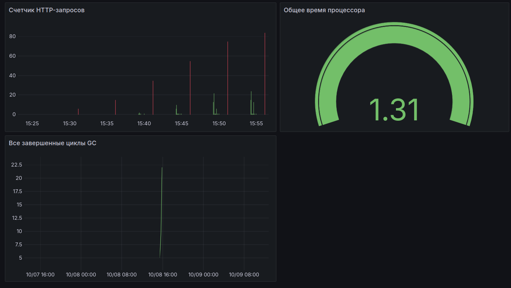

# Описание
Репозиторий с домашними заданиями по курсу Python Backend ИТМО.

# Запуск ДЗ 1
1. ```git clone git@github.com:hilkovich/itmo_python_backend.git```
2. ```cd itmo_python_backend```
3. ```python3 -m venv venv```
4. ```source venv/bin/activate```
5. ```pip install -r requirements.txt```
6. ```cd hw_1```
7. ```uvicorn hw_1:app```
8. ```pytest test_hw_1.py (в другом терминале сделав п.2 и п.6)```

# Скриншет ДЗ 3


# Автор
Хилькович Николай Федорович
